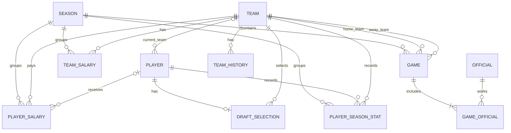

# Modelo Entidad-Relación

```mermaid
erDiagram
    TEAM o|--o{ PLAYER : current_team
    SEASON ||--o{ GAME : contains
    TEAM ||--o{ GAME : home_team
    TEAM ||--o{ GAME : away_team
    SEASON ||--o{ TEAM_SALARY : groups
    TEAM ||--o{ TEAM_SALARY : has
    SEASON ||--o{ PLAYER_SALARY : groups
    TEAM ||--o{ PLAYER_SALARY : pays
    PLAYER o|--o{ PLAYER_SALARY : receives
    PLAYER ||--o| DRAFT_SELECTION : has
    TEAM ||--o{ DRAFT_SELECTION : selects
    GAME ||--|{ GAME_OFFICIAL : includes
    OFFICIAL ||--o{ GAME_OFFICIAL : works
    TEAM ||--o{ TEAM_HISTORY : has
    SEASON ||--o{ PLAYER_SEASON_STAT : groups
    PLAYER ||--o{ PLAYER_SEASON_STAT : records
    TEAM ||--o{ PLAYER_SEASON_STAT : records
```

`GAME_OFFICIAL` resuelve la relación muchos a muchos entre partidos y árbitros.
`PLAYER_SEASON_STAT` recibe la ingesta solicitada desde NBA API.

